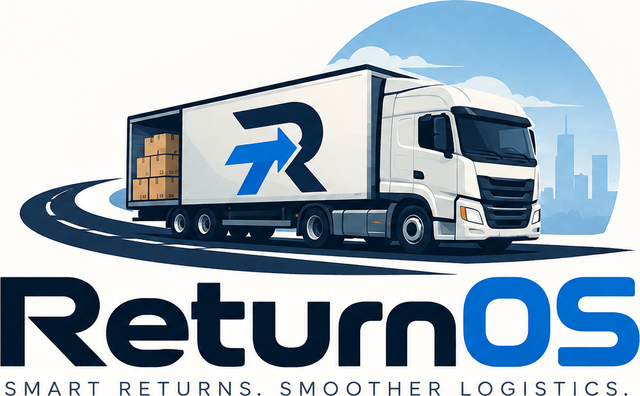

<div align="center">



**Smart returns. Smoother logistics.**

A returns-management platform built as three connected products on one backend —
a customer storefront, a warehouse floor tool, and an admin console.

[](https://openjdk.org/projects/jdk/21/)
[](https://spring.io/projects/spring-boot)
[](https://www.postgresql.org/)
[](https://react.dev/)
[](https://vite.dev/)
[](#testing)

[Live demo](https://returnos-sandy.vercel.app) · [API](https://returnos-backend.onrender.com/api/health) · [Demo accounts](#demo-accounts)

</div>

---

A customer buys something and asks to send it back. An operator receives the
parcel, inspects it and decides what physically happens to the goods. The
backend turns that into money — a refund, store credit, or a replacement order —
and the customer watches it happen. Admin sees all of it.

The point of the project is that those three views never disagree, because
there is exactly one source of truth underneath them.

---

## Contents

- [What it does](#what-it-does)
- [Architecture](#architecture)
- [Quick start](#quick-start)
- [Demo accounts](#demo-accounts)
- [Public demo mode](#public-demo-mode)
- [Configuration](#configuration)
- [Deployment](#deployment)
- [The lifecycle](#the-lifecycle)
- [Design decisions worth knowing](#design-decisions-worth-knowing)
- [Data model](#data-model)
- [API surface](#api-surface)
- [Testing](#testing)
- [Troubleshooting](#troubleshooting)
- [Project layout](#project-layout)
- [Known limitations](#known-limitations)

---

## What it does

### Customer

Browse a catalogue, add to cart, check out, track an order to delivery, then
raise a return against a delivered item. Pick a resolution — refund,
replacement, exchange or store credit — upload evidence, and follow the return
on a timeline. Store credit lands in a ledger and can be spent on the next
order.

### Warehouse

A queue of returns with derived priority and SLA. Receive a parcel (recording
its condition and any discrepancy), inspect it line by line, then choose a
disposition: restock, resell, repair, return to vendor, recycle or dispose.
Inventory moves between operational states, tasks are created by the work
itself, and everything is audited.

### Admin

Read-across visibility of every customer, order, return, warehouse and
inventory movement. Manage the catalogue, adjust store credit with a mandatory
reason, tune settings, handle support tickets, and export CSV reports. Admin
sees everything and writes almost nothing — deliberately.

---

## Architecture

```
          ┌──────────────┐  ┌──────────────┐  ┌──────────────┐
          │   Customer   │  │  Warehouse   │  │    Admin     │
          │  storefront  │  │    floor     │  │   console    │
          └──────┬───────┘  └──────┬───────┘  └──────┬───────┘
                 │                 │                 │
                 └────────── React 19 / Vite ─────────┘
                                   │  HTTPS, JWT bearer
                                   ▼
                       Java 21 + Spring Boot (/api/v1)
                                   │
                 ┌─────────────────┴─────────────────┐
                 │  controllers → services → JDBC    │
                 │  ← all business logic lives here  │
                 └─────────────────┬─────────────────┘
                                   ▼
                        PostgreSQL (Flyway V1..V8)
```

| | |
|---|---|
| **Backend** | Java 21, Spring Boot 3.5, Spring Security, Spring JDBC, PostgreSQL, Flyway, JJWT, BCrypt, AWS SDK v2 (S3) |
| **Frontend** | React 19, Vite 8, react-router 7, CSS Modules + design tokens, lucide-react |
| **Tests** | JUnit 5 + MockMvc + Testcontainers (backend), Vitest + Testing Library (frontend), Playwright (end-to-end) |
| **Schema** | Flyway migrations in `backend-java/src/main/resources/db/migration` (`V1..V8`) |
| **Money** | Integer paise throughout (`*_paise` columns). Never floats |

The frontend performs **no business logic and no financial writes**. Every
price, total, eligibility decision and status transition comes from the server.
Spring JDBC is used directly rather than an ORM — the queries are the model.

---

## Quick start

Requires **Java 21**, **PostgreSQL 16+**, **Node 20+**. Maven ships as a wrapper.

```bash
# 1. Database
createdb returnos
```

```bash
# 2. Backend — http://localhost:8080
#    Flyway migrates V1..V8 on boot, including the demo catalogue and accounts.
cd backend-java
export DATABASE_URL=jdbc:postgresql://localhost:5432/returnos
export DATABASE_USERNAME=returnos DATABASE_PASSWORD=returnos
export JWT_SECRET=<at-least-32-characters>
./mvnw spring-boot:run            # Linux/macOS
.\mvnw.cmd spring-boot:run        # Windows
```

```bash
# 3. Frontend — http://localhost:5173 (proxies /api to :8080)
cd frontend
npm install
npm run dev
```

Open <http://localhost:5173> and sign in with any [demo account](#demo-accounts).
The app routes you to the right module based on your role.

### Scripts

| Command | Where | What it does |
|---|---|---|
| `./mvnw spring-boot:run` | `backend-java` | Dev server |
| `./mvnw test` | `backend-java` | Integration tests (needs PostgreSQL) |
| `./mvnw package -DskipTests` | `backend-java` | Production jar → `target/returnos-backend-1.0.0.jar` |
| `npm run dev` | `frontend` | Vite dev server |
| `npm test` | `frontend` | Unit tests |
| `npm run test:e2e` | `frontend` | Playwright (starts the jar + Vite itself) |
| `npm run build` | `frontend` | Production build → `dist/` |
| `npm run lint` | `frontend` | oxlint |

> **Note** — Windows users: use `.\mvnw.cmd` in place of `./mvnw` throughout.

---

## Demo accounts

Seeded by Flyway migration `V7__demo_seed.sql` on every fresh database.

| Role | Email | Password |
|---|---|---|
| Customer | `customer@returnos.test` | `Customer123` |
| Warehouse | `warehouse@returnos.test` | `Warehouse123` |
| Admin | `admin@returnos.test` | `Admin123` |

Warehouse and admin accounts are **seeded, never self-registered** — public
signup always creates a `CUSTOMER`, so there is no privilege-escalation path
from registration.

---

## Public demo mode

Set `DEMO_MODE=true` on a public deployment. The three demo accounts above then
run under a policy enforced in the security filter, **before any controller**.

The demo exists to be driven, so the workflows it is meant to show stay usable:

| Allowed | Blocked (`403 DEMO_MODE`) |
|---|---|
| All reads, across all three modules | Everything under `/api/v1/admin/**` except the support desk |
| Cart, checkout, place order | `signup`, `forgot`, `reset` — fills the shared user table or alters shared credentials |
| Raise and cancel returns | `profile/change-password` — would lock every visitor out of the shared account |
| Addresses, notifications, support, feedback | `uploads/**` — writes real objects into the storage bucket |
| **The entire warehouse floor**: approve, receive, inspect, dispose | |

The `/api/v1/admin/**` namespace is **fail-closed**: a newly added admin write
is blocked until it is explicitly judged demo-safe, rather than being exposed by
default.

Blocked requests return `403` with `{"code":"DEMO_MODE"}`; the frontend catches
that code centrally and shows a styled dialog instead of a raw error. Buttons
stay clickable, so the block reads as intentional rather than broken.

Leave `DEMO_MODE` unset (default `false`) for development, tests and private
deployments.

---

## Configuration

All configuration is environment-driven; nothing is hardcoded and no secret is
committed. Defaults suit local development.

| Variable | Default | Notes |
|---|---|---|
| `DATABASE_URL` | `jdbc:postgresql://localhost:5432/returnos` | **JDBC** URL — must start with `jdbc:` |
| `DATABASE_USERNAME` / `DATABASE_PASSWORD` | `returnos` | PostgreSQL credentials |
| `PORT` | `8080` | Injected by most hosts automatically |
| `JWT_SECRET` | *(none)* | **≥ 32 characters.** The app refuses to start without it |
| `JWT_EXPIRATION_DAYS` | `7` | Token lifetime |
| `RETURNOS_CORS_ORIGINS` | `http://localhost:5173` | Exact frontend origin(s), comma separated. `CORS_ORIGINS` is accepted as a fallback |
| `DEMO_MODE` | `false` | `true` for a public deployment — see [demo mode](#public-demo-mode) |
| `STORAGE_PROVIDER` | `local` | `local` or `s3` |
| `UPLOAD_DIR` | `./uploads` | Local storage path (when `STORAGE_PROVIDER=local`) |
| `AWS_REGION` / `AWS_S3_BUCKET` | `ap-south-1` / `returnos` | Used when `STORAGE_PROVIDER=s3` |
| `AWS_ACCESS_KEY_ID` / `AWS_SECRET_ACCESS_KEY` | *(none)* | **Environment only, never committed.** Read via the AWS SDK default credential chain |
| `VITE_API_URL` | *(empty)* | Frontend only. Backend origin for split hosting; empty means same-origin |

### CORS

Origins are compared **byte for byte** against the browser's `Origin` header.
The parser trims whitespace, drops blank entries and strips a trailing slash, so
a value pasted from a dashboard like `http://localhost:5173, https://app.com/`
still works. Wildcards are deliberately unsupported — credentials are enabled,
and a browser requires an exact origin in that case. An empty list fails fast at
startup rather than silently allowing nothing.

### File storage

Document uploads (`POST /api/v1/uploads/return/:id`) store only the object key
(`returns/{returnId}/photos/{generated}`) in PostgreSQL — never the binary.
Downloads are ownership-checked first, then streamed through the backend for
local storage, or handed out as **short-lived (5 minute) pre-signed URLs** for
S3. The bucket stays private and credentials never reach the frontend.

---

## Deployment

Frontend → **Vercel**, backend → **Render**, database → managed **PostgreSQL**.

| | |
|---|---|
| Frontend | <https://returnos-sandy.vercel.app> |
| Backend | <https://returnos-backend.onrender.com> |
| Health check | `GET /api/health` |

**Frontend (Vercel)** — build `npm run build`, output `dist/`. Set
`VITE_API_URL` to the backend origin. A `vercel.json` SPA fallback is included.

**Backend (Render)** — build `./mvnw package -DskipTests`, start
`java -jar target/returnos-backend-1.0.0.jar`. Set the variables from
[Configuration](#configuration); at minimum `DATABASE_URL`,
`DATABASE_USERNAME`, `DATABASE_PASSWORD`, `JWT_SECRET` and
`RETURNOS_CORS_ORIGINS`.

```
RETURNOS_CORS_ORIGINS = https://returnos-sandy.vercel.app
```

Exact origin — no trailing slash, no quotes.

Flyway migrates on boot (deterministic `V1..V8`, including the demo seed). No
worker or scheduler process is required; the fulfillment ticker runs in-process
and can be disabled with `returnos.fulfillment-enabled=false`.

---

## The lifecycle

This is the path the whole system is built around.

```
CUSTOMER          places order ──▶ ORDER
                                    │  scheduler simulates the carrier
                                    ▼
                                 DELIVERED
                                    │
CUSTOMER          raises return ──▶ RETURN (REQUESTED)
                                    │
WAREHOUSE         approve ─────────▶ approved_at stamped
                  receive ─────────▶ RECEIVED    ──▶ customer sees "Return received"
                  inspect ─────────▶ INSPECTION  ──▶ customer sees "Inspection"
                  disposition ─────▶ goods moved to their new inventory state
                                    │
BACKEND           resolveReturnAtResolved()
                                    │
                    ┌───────────────┼───────────────┬──────────────┐
                    ▼               ▼               ▼              ▼
                 REFUND       STORE CREDIT     REPLACEMENT     EXCHANGE
                              (ledger entry)   (new order linked to the return)
                                    │
CUSTOMER          spends the credit on a new order ──▶ back to the top
```

Customer and warehouse do not push updates to each other. They both read the
same `return_events` timeline, so the customer's status *is* the warehouse's
status.

---

## Design decisions worth knowing

These are the parts that are easy to get wrong, and the reasoning behind how
they work.

### One resolution engine

`resolveReturnAtResolved()` is the **only** code that issues store credit,
completes a refund, or creates a replacement/exchange order. The warehouse and
admin modules call it; neither reimplements it. A second implementation would
be a second source of financial truth.

### Approval is independent of status

`returns.approved_at` is a separate stamp, not a status value. Receiving a
parcel proves it arrived, **not** that the claim was accepted. If goods are
received without approval, the physical work continues (they have to go
somewhere) but the payout is **held**, a warning is audited, and it surfaces on
the dashboard as `pendingApproval`. Approving later releases the held
resolution.

### Duplicate work is blocked by the database

Not by application checks alone:

```sql
receiving_records   UNIQUE (return_id)
inspections         UNIQUE (return_id)
dispositions        UNIQUE (return_item_id)
store_credit_ledger UNIQUE (reference_type, reference_id)
inventory_movements UNIQUE (reference_type, reference_id, reason, product_id)
```

A retried request conflicts instead of double-applying.

### Two stock numbers that cannot drift

`products.stock` is what the storefront sells from. The `AVAILABLE` inventory
bucket is what the warehouse counts as sellable. They must always agree, so
**both are written in a single transaction**, and checkout routes its decrement
through the same engine. If the bucket ever comes up short it is clamped — and
the clamp is recorded as `WARNING_INVENTORY_CLAMPED`, because a silent clamp
hides real drift.

### Roles are read from the database, never from the token

The JWT carries a role claim, but every request re-reads the role and the
`active` flag from the database. Disabling or demoting an account takes effect
on the **next request**, not at token expiry. A token claiming `role: ADMIN` for
a customer's account is worthless.

### Warehouse operators are scoped to their site

Every operational table carries `warehouse_id`, and queries filter on the
operator's own site. Another site's task returns the same `404` as a task that
does not exist, so queues cannot be probed by id. Admin sees all sites by
design — but an admin token still gets `403` on `/warehouse/**` and on the
customer API. Breadth of visibility is not a universal key.

### The scheduler stops at IN_TRANSIT

The fulfillment ticker simulates the carrier leg only. Everything from
`RECEIVED` onward is driven by real operator actions. Without that boundary the
timer would receive and resolve returns before anyone touched them.

### Settings are tunable parameters only

Return window, SLA hours and shipping thresholds live in a database-backed
settings table. The **resolution matrix stays in code** — which dispositions an
inspection result permits, the paise arithmetic, and the approval gate are not
editable from the UI. This is a deliberate boundary, not an oversight.

---

## Data model

Core entities (customer side):

```
users ── orders ── order_items ── returns ── return_items
   │        │                        │
   ├── addresses                     ├── return_events   (the shared timeline)
   ├── cart_items                    ├── pickups         (inbound shipment)
   └── store_credit_ledger           └── refunds
```

Warehouse operations build on top rather than duplicating:

```
warehouses ── warehouse_locations
     │
     ├── receiving_records   (one per return)
     ├── inspections ── inspection_items
     ├── dispositions        (one per returned line)
     ├── inventory_buckets   (quantity per product per state)
     ├── inventory_movements (append-only stock ledger)
     ├── warehouse_tasks     (created by the work itself)
     └── audit_log           (append-only)
```

Admin adds `categories`, `settings`, `notification_templates` and its own
`admin_audit_log`, kept separate from the warehouse trail.

**Inventory states** — `AVAILABLE`, `RETURNED`, `INSPECTION`, `DAMAGED`,
`REPAIR`, `RESALE`, `VENDOR_RETURN`, `RECYCLE`, `DISPOSAL`, `RESERVED`.

---

## API surface

All routes live under `/api/v1`. Roughly 120 endpoints:

| Group | Count | Auth |
|---|---|---|
| `/auth` | 5 | public |
| Customer — `/products`, `/cart`, `/checkout`, `/orders`, `/returns`, `/credit`, `/addresses`, `/profile`, `/support`, … | ~47 | `CUSTOMER` |
| `/warehouse/**` | 18 | `WAREHOUSE` + site scope |
| `/admin/**` | 56 | `ADMIN` |

Errors are always `{ code, message, errors? }` with machine-readable codes such
as `ALREADY_RECEIVED`, `DISPOSITION_NOT_ALLOWED`, `INSUFFICIENT_INVENTORY`,
`ADMIN_SELF_LOCKOUT`, `DEMO_MODE`. A global handler covers validation,
malformed JSON, oversized uploads and unexpected failures. **Stack traces, SQL,
file paths and secrets are never returned** — unexpected errors log server-side
and return a generic `INTERNAL_ERROR`.

---

## Testing

```bash
cd backend-java && ./mvnw test      # 48 tests, 11 classes (needs PostgreSQL)
cd frontend && npm test             # 17 tests,  3 files
cd frontend && npm run test:e2e     # 37 Playwright tests vs the real jar + PostgreSQL
```

The suites are built around the failure modes that actually matter:

- **Authorization matrix** — every admin endpoint against every role (admin,
  warehouse, customer, anonymous, forged token), with instant revocation: a live
  session with a still-valid token loses access on the very next request after
  the account is disabled.
- **Money invariants** — store credit issued exactly once; a refund resolution
  issues no credit; interleaved restock-and-sale cannot make the two stock
  numbers drift; a failed movement rolls back both writes.
- **Workflow ordering** — cannot inspect before receiving, cannot dispose before
  inspecting, cannot do either twice.
- **Demo policy** — workflow mutations reach their controllers while sensitive
  ones are rejected *and leave no database effect*.
- **CORS preflight** — the deployed origin is accepted even when configured with
  stray whitespace or a trailing slash; an unknown origin is still rejected.
- **Cross-system e2e** — a customer order and return, processed on the warehouse
  floor, verified as visible in Admin, across three separate browser contexts.

Backend tests use Testcontainers by default. To run against a database you
provide instead:

```bash
docker run -d --name returnos-test-pg \
  -e POSTGRES_USER=test -e POSTGRES_PASSWORD=test -e POSTGRES_DB=returnos_test \
  -p 5433:5432 postgres:16-alpine -c max_connections=300

TEST_DB_URL=jdbc:postgresql://localhost:5433/returnos_test \
TEST_DB_USERNAME=test TEST_DB_PASSWORD=test ./mvnw test
```

`max_connections=300` matters: each cached Spring context holds its own
connection pool, and the default of 100 is not enough for the full suite.

Playwright wipes and reseeds its own database (`returnos_e2e`, port 5433 by
default — see `frontend/e2e/global-setup-java.ts`) before every run, so tests
read a known baseline. **Running the e2e suite resets that data** — never point
it at production.

---

## Troubleshooting

<details>
<summary><strong>CORS preflight returns 403 in production</strong></summary>

Check `RETURNOS_CORS_ORIGINS` is the **exact** frontend origin — no trailing
slash, no quotes — then redeploy. `GET /api/health` succeeding proves nothing
here: it is a simple request and never triggers a preflight.
</details>

<details>
<summary><strong>Backend returns 502 on every route, including login</strong></summary>

Usually the app never started. `JWT_SECRET` shorter than 32 characters makes it
fail fast by design, and a missing or non-`jdbc:` `DATABASE_URL` stops Flyway.
Check the boot logs before looking at anything route-specific.
</details>

<details>
<summary><strong><code>FATAL: sorry, too many clients already</code> during tests</strong></summary>

The test database is out of connections. Start PostgreSQL with
`-c max_connections=300` as shown above.
</details>

<details>
<summary><strong>Testcontainers cannot find a Docker environment</strong></summary>

Some Docker Desktop versions negotiate an API version the client rejects. Use
the `TEST_DB_URL` escape hatch above and run PostgreSQL yourself — no
application code needs to change.
</details>

---

## Project layout

```
backend-java/
  src/main/java/com/returnos/
    auth/            SecurityConfig, JwtService, JWT filter, demo policy
    admin/           read models, catalogue, finance, sites, users, reports
    warehouse/       queue, receiving, inspection, disposition, inventory, tasks
    orders/ returns/ commerce/ customer/ care/     customer-facing domains
    storage/         StorageService + local and S3 implementations
    fulfillment/     carrier-leg simulation (stops at IN_TRANSIT)
    common/          ApiException + global exception handler, health, meta
  src/main/resources/db/migration/   Flyway V1..V8
  src/test/java/                     JUnit + MockMvc integration tests

frontend/
  src/
    components/      shared UI primitives, Logo, ErrorBoundary, DemoModeDialog
    pages/customer/  storefront, cart, checkout, orders, returns
    pages/warehouse/ queue, receiving, inspection, disposition, inventory, tasks
    pages/admin/     the admin console
    pages/home/      public marketing site
    lib/             API clients, session, cart provider, demo-mode signal
  e2e/               Playwright specs + PostgreSQL reset
  public/            logo, favicons, static assets
```

The warehouse and admin consoles share one visual language — both are
operational tools. The customer storefront has its own, consumer-facing
aesthetic. Branding comes from a single `Logo` component backed by
`public/returnos-*.png`, so the mark is defined in exactly one place.

---

## Known limitations

An honest list of what is not done or deliberately constrained.

- **Payment is a test flow.** Orders are marked `PAID` with method `TEST`. No
  payment provider is integrated; the architecture keeps that replaceable.
- **Refunds are read-only from Admin, by design.** Refund transitions belong to
  the resolution engine. Admin can see a refund but cannot push it forward.
- **Carrier tracking is not live.** Tracking numbers and carriers are recorded,
  but nothing contacts a carrier API — shipment status is this system's own view.
- **Single warehouse operationally.** The schema carries `warehouse_id`
  everywhere and a second site is exercised in tests, so going multi-site is a
  data and authorization change rather than a rewrite.
- **Granular RBAC is scaffolded, not active.** 21 permission strings are
  registered and every route already passes one, but the check resolves on role
  today. Per-permission grants slot in without touching call sites.
- **Support tickets have no category field.** No real data ever existed behind
  it, so it was left out rather than invented.
- **Password reset is out of scope.** No email service is wired up.
- **Product imagery is served from Unsplash.** Convenient for a demo, but an
  external dependency at runtime.
- **Browser coverage.** The e2e suite runs on Chromium. Mobile viewports are
  covered for the customer storefront but not the admin console.

---

## License

No license file is included. All rights reserved by the repository owner unless
stated otherwise.
